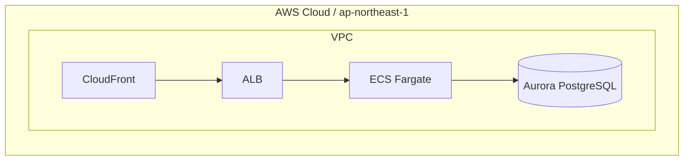

# Infra Document — Stage 5 (Living infrastructure documentation)

Produce the single source-of-truth document for an environment's infrastructure, plus an editable
architecture diagram. This is a **living document**: re-run it whenever the infra changes so the
doc and diagram stay accurate (derived from code, not hand-maintained).

> **Human gate G5:** This skill writes docs + a diagram and then **STOPS**. It does not commit and
> does not run `terraform apply`. Hand the document back for the human to review.

**Argument:** `$ARGUMENTS` first token = the environment dir to document (e.g.
`environments/dev-care-hub`). Default: current dir. Ask if ambiguous.

**Outputs (in the project):**
- `docs/infrastructure.md` — the document (template: `knowledge/templates/infra-document-template.md`)
- `docs/diagrams/infra.drawio` — editable source diagram (one combined AWS-grouped diagram)
- A temporary **Mermaid** block inside `infrastructure.md` for cross-checking the `.drawio`
- `README.md` — top-level repo entry point (Phase 4.5; created or refreshed, never clobbered)

---

## Phase 1: Gather the facts (derive, don't invent)

Read the real sources so the document is *as-built*, not aspirational:

1. **Spec** — `docs/specs/*.spec.md` (architecture intent, environments, cost, SLO).
2. **Terraform** — the env dir's `main.tf` (which modules are instantiated and **how their outputs
   wire into each other** — this defines the real topology), `terraform.tfvars`, `locals.tf`,
   `backend.tf`, `providers.tf`.
3. **Module catalog** — `MODULES.md` at the custom-infrastructure library root (purpose + I/O of
   each module used).
4. **Review report** — read the latest `docs/reviews/<env>-*.md` (written by `/infra-review`);
   fold its resolved security/cost posture into §7. Pick the newest by date if several exist.
5. **Live outputs (optional)** — only if already applied and the user confirms: `terraform output`
   for real endpoints/ARNs. Never run apply.

Build a component list: `module → AWS resource(s) → role → key inputs/outputs → which subnet/tier`.

## Phase 2: Write `docs/infrastructure.md`

Resolve the template from the guideline repo via the symlinked skill (same mechanism as
`/secret-scan` — the template is read live from the repo, not copied into projects; `readlink -f`
follows the symlink so it works from any project on any machine):

```bash
SK="$(readlink -f "${CLAUDE_SKILL_DIR:-$HOME/.claude/skills/infra-document}" 2>/dev/null)"
GUIDELINE="$(dirname "$(dirname "$(dirname "$SK")")")"
TPL="$GUIDELINE/knowledge/templates/infra-document-template.md"
test -f "$TPL" && echo "template: $TPL" \
  || echo "ERROR: template not found — is the guideline repo present and the skill symlinked? (Guide §1.1)"
```

`Read` `$TPL` (8 sections) and fill it from Phase 1. The template is **comprehension-first** — a
reader should finish §1–§3 with a correct mental model, then use §4–§8 as reference. Rules:
- State facts derived from code; if something isn't in the code/spec, mark it `TODO` — don't guess.
- **§1 Overview** — include the **"big picture"** paragraph: what enters, what happens, what comes
  out, and the 2–4 main building blocks, in **plain language with no resource names/jargon**. A
  newcomer reads only this and gets the gist.
- **§2** holds the diagram (PNG ref + temporary Mermaid, see Phase 4), a **"How to read this
  diagram"** line (shapes/colors/numbered edges — see Phase 3), and a one-line **numbered-path key**
  (`① → ② → ③ …`) that decodes the diagram's edges. There is **no separate data-flow section** — that
  key plus the §3 walkthrough (which references the same numbers) covers it.
- **§3 How it works (architecture walkthrough)** — the section that makes the infra *click*. This is
  the most important content in the doc; do not reduce it to a table. **Format for scanning, not an
  essay** — a DevOps/SA should skim the bold labels and bullets and get it:
  - Structure as a few **labeled blocks** (e.g. one bold lead-in per subsystem/phase, plus a final
    **"Key design decisions"** block). Use **short bullets**, not dense multi-line paragraphs.
  - Group by **subsystem or by flow**, not by Terraform module.
  - For each major part answer three things: **what it is · why it's here · what it connects to.**
  - Call out **key design decisions and the non-obvious** ("X is the handoff between the two halves",
    "Y exists only so Z passes its check", "single-AZ on purpose — it's a dev lab").
  - **Name the same components shown in the diagram** and **weave the diagram's ① ② ③ numbers into
    the bullets**, so this section doubles as the flow explanation (no separate data-flow section).
  - Keep it tight — a handful of labeled blocks, a few bullets each; push the exhaustive list to §4.
- §4 Components is the **reference table**; §3 explains, §4 enumerates — don't duplicate prose into
  the table.
- Link out rather than duplicate: spec, review report, dashboards.
- The template intentionally has **no Operations/runbook or change-log section** — this doc describes
  what the infrastructure *is*, not how to operate it. Keep ops/runbooks in their own doc.

## Phase 3: Write `docs/diagrams/infra.drawio` (one combined diagram)

Create `docs/diagrams/` if needed. Hand-author **one** combined diagram following
[`drawio-reference.md`](drawio-reference.md) — the proven AWS4 stencil patterns:

- Nest groups: **AWS Cloud → Region → (Account) → VPC → public/private subnet → resources**
  (each child's geometry is relative to its parent via `parent=`).
- Use `mxgraph.aws4.resourceIcon` per service with the category fill colors from the reference
  (compute orange, networking purple, database blue/magenta, storage green, security red).
- Draw edges left→right (ingress → compute → data); number the main data-plane edges `① ② ③`,
  dash metadata/IAM edges. Add a title and a legend.
- Map every component from Phase 1 to exactly one node; wire edges from the Terraform output→input
  relationships you found in `main.tf`.
- If unsure of an exact `resIcon` name, use the labeled fallback box (reference §Special shapes)
  rather than a wrong stencil that renders empty.
- **Write the matching "How to read this diagram" line into §2** of `infrastructure.md` — explain
  the conventions you actually used (nesting, numbered solid vs dashed edges, category colors) so a
  reader can decode the picture without guessing. The diagram and this legend must agree.

Validate the file is well-formed before finishing. Use a parser that does **not** resolve external
entities or hit the network (avoids XXE / billion-laughs — drawio files need no DTD/entities):
```bash
# Preferred: libxml2's xmllint (no network, no external entities)
xmllint --nonet --noout docs/diagrams/infra.drawio && echo "drawio XML OK"
# Fallback if xmllint is unavailable (defusedxml hardens the stdlib parser):
python3 -c "import defusedxml.ElementTree as ET; ET.parse('docs/diagrams/infra.drawio'); print('drawio XML OK')"
```
(Do not use the plain `xml.dom.minidom` / `xml.etree` stdlib parsers — they are XXE-vulnerable by default.)

## Phase 3.5: Coverage check (diagram vs code)

Make sure the diagram didn't drop a component. List the module instances in the env's `main.tf` and
confirm each appears as a node in `infra.drawio` (and a row in §4 Components):

```bash
grep -nE '^[[:space:]]*module[[:space:]]+"' <env-dir>/main.tf
```

For every module found, verify there's a matching node + components row. **Flag any module missing
from the diagram** and add it — or note why it's intentionally omitted (e.g. a pure IAM/role module).
This catches "drew it but forgot X" before the human reviews at G5.

## Phase 4: Mermaid verification block (temporary)

Inside `infrastructure.md` §2, emit the **same** topology as a Mermaid `flowchart` so the human can
cross-check the `.drawio` without opening draw.io (guards against a malformed/incorrect diagram).
Wrap it with clear delete markers and a PNG placeholder:

````markdown
## 2. Architecture diagram


<!-- ^ PNG not exported yet. Source: diagrams/infra.drawio -->

<!-- VERIFICATION DIAGRAM — delete after confirming infra.drawio (then export drawio → infra.png) -->

<!-- END VERIFICATION DIAGRAM -->
````

The Mermaid must mirror the `.drawio` exactly (same nodes + edges). It is **disposable** — tell the
user to delete it after they confirm the drawio and export the PNG.

## Phase 4.5: Project README (repo entry point)

Write a top-level `README.md` — the **entry point** a reader (or a public visitor) sees first. Keep
it **short**: it orients and links out; `docs/infrastructure.md` holds the depth (don't duplicate).
**If `README.md` already exists, don't clobber it** — refresh only the pipeline-managed sections (or
show a diff and ask). Derive everything from the same facts as Phase 1.

Structure:
```markdown
# <project> — <one-line what-it-is>

<2–3 sentence overview: what this provisions and why. Plain language.>

## Stack
<key services / tools — one line>

## Layout
- `environments/<env>/` — Terraform root(s)   ·   `modules/` — reused modules
- `docs/specs/` — design spec   ·   `docs/infrastructure.md` — **architecture & diagram (start here)**
- `docs/reviews/` — security/cost review reports

## Prerequisites
<terraform version, AWS profile/creds, TF_MODULE_LIB if modules are vendored, tflint/checkov/trivy for local scans>

## Deploy
```bash
cd environments/<env>
terraform init -backend-config=<backend>.hcl
terraform plan -out=tfplan
terraform apply tfplan
```

## Security / CI
- IaC scan gate: `.github/workflows/iac-scan.yml` (fmt/validate/tflint/checkov/trivy on every PR)
- Secret scan gate: `.github/workflows/secret-scan.yml` + local pre-push hook
- Never commit `.mcp.json` / `backend-*.hcl` (gitignored).
```

Adjust sections to what actually exists (omit Deploy specifics you can't derive; mark TODO rather
than guess). This is **public-facing**, so no account IDs, ARNs, or secrets in the README.

## Phase 5: STOP at Gate G5

```
## Infrastructure doc ready for review (G5)

Written:
- docs/infrastructure.md
- docs/diagrams/infra.drawio   (drawio XML OK)
- README.md   (repo entry point — created/refreshed)
- Mermaid verification block embedded in §2 (temporary)

### Diagram summary: [N nodes, M edges; ingress → compute → data]
### Components documented: [list modules/resources]

---
👉 Next:
   1) Open docs/diagrams/infra.drawio in draw.io and check it matches the Mermaid block.
   2) Export it to docs/diagrams/infra.png, then delete the Mermaid verification block.
   3) Review docs/infrastructure.md — does §1–§3 make the infra clear on a single read?
   Re-run /infra-document anytime the infra changes — it's a living document.
```

**Do not commit.** Wait for the human.
