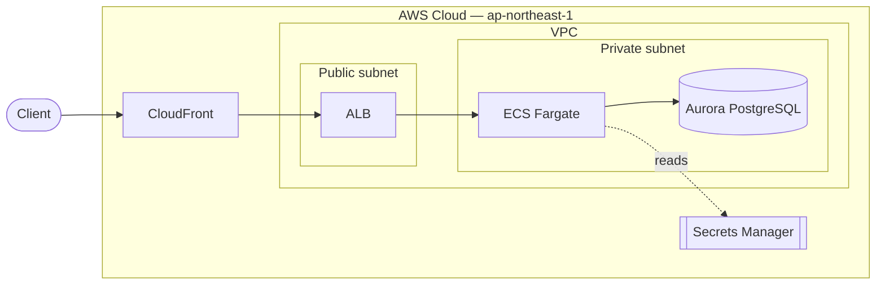

<!--
  Infrastructure Document Template (living doc)
  Produced/refreshed by /infra-document (Stage 5). Derive every fact from the spec + Terraform
  code; mark anything unknown as TODO — do not invent. Re-run the skill when infra changes.
-->

# Infrastructure — <project> / <environment>

- **Environment:** <dev-care-hub>   **Region:** <ap-northeast-1>   **Account:** <id/alias>
- **Source of truth:** Terraform at `<environments/...>` · Spec: [`../specs/<name>.spec.md`](../specs/<name>.spec.md)
- **Last generated:** <YYYY-MM-DD> by `/infra-document` (living document — re-run after changes)

## 1. Overview
- **Purpose:** <what this system does, in 1–3 sentences>
- **Stack:** <ECS Fargate / Aurora PostgreSQL / ALB / CloudFront …>
- **Scope of this doc:** this environment only (link sibling envs if relevant)

## 2. Architecture diagram

<!-- ^ PNG not exported yet. Source: diagrams/infra.drawio (open in draw.io → Export → PNG). -->

<!-- VERIFICATION DIAGRAM — delete after confirming infra.drawio matches, then export drawio → infra.png -->

<!-- END VERIFICATION DIAGRAM -->

## 3. Components
| Module | AWS resource(s) | Role | Tier / subnet |
|--------|-----------------|------|---------------|
| `network` | VPC, subnets, NAT, IGW | Network foundation | — |
| `alb` | ALB + SG + listeners | Ingress / routing | public |
| `ecs` / `ecs_cluster` | Fargate service + cluster | App compute | private |
| `rds` | Aurora cluster + Secrets Manager | Datastore | private |
| … | … | … | … |

## 4. Network
- **VPC CIDR:** <10.x.0.0/16> · **AZs:** <…>
- **Subnets:** public (<which>), private (<which>)
- **Security groups:** <ALB SG → ECS SG → RDS SG; default-deny + explicit allow>
- **Egress:** <single NAT (dev) / per-AZ NAT (prod)>; VPC endpoints: <list>

## 5. Data flow
1. <Client → CloudFront → ALB → ECS service>
2. <ECS → Aurora (read/write); ECS → ElastiCache (cache)>
3. <ECS → Secrets Manager (DB creds at boot)>
(Numbered to match the diagram's ① ② ③ edges.)

## 6. Environments & naming
- **Prefix:** `<env>-<app_name>` (e.g. `dev-care-hub`)
- **State:** S3 `key = "<env>/terraform.tfstate"`, `use_lockfile = true`
- **Sibling environments:** <dev / stg / prod — link their docs>

## 7. Security posture
- **IAM:** <roles, least-privilege; OIDC for CI>
- **Encryption:** <at rest: RDS/S3/EBS; in transit: TLS; KMS keys>
- **Secrets:** <Secrets Manager / SSM — what's stored>
- **Edge protection:** <WAF / CloudFront>
- **Review:** last `/infra-review` result → <go / open items> (link report if any)

## 8. Cost summary
| Item | Config | Cost/month (est.) |
|------|--------|--------------------|
| … | | |
| **Total (est.)** | | |
(From the spec §6 / `aws-pricing`. Update on resize.)

## 9. Operations
- **Deploy:** <CI/CD pipeline / `devops-engineer`>
- **Monitoring:** <dashboards, alarms — link>
- **Incidents:** <runbook / `incident-responder`>
- **Rollback:** <CodeDeploy blue-green / `terraform apply` previous plan / state restore>

## 10. How to regenerate / change log
- Regenerate: `/infra-document <env-dir>` (living doc).
- After editing the diagram: open `diagrams/infra.drawio` → Export PNG → `diagrams/infra.png` →
  delete the Mermaid verification block in §2.
- **Change log:**
  - <YYYY-MM-DD> — initial document
